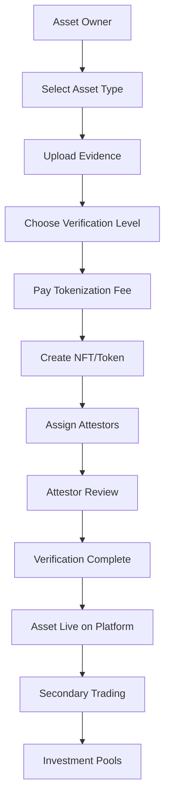

# 🌍 TrustBridge Universal Asset Protocol for Africa

## 📋 Table of Contents
1. [Overview](#overview)
2. [Supported Asset Types](#supported-asset-types)
3. [Tokenization & Verification Flow](#tokenization--verification-flow)
4. [Business Model](#business-model)
5. [Technical Architecture](#technical-architecture)
6. [Deployment Status](#deployment-status)
7. [Getting Started](#getting-started)

---

## 🎯 Overview

**TrustBridge** is a revolutionary real-world asset (RWA) tokenization platform specifically designed for the African market. Built on Hedera Hashgraph, it enables farmers, property owners, and small businesses to tokenize their assets and access global capital markets.

### 🌟 Mission
Democratize access to capital for African entrepreneurs by tokenizing real-world assets and creating a bridge between traditional African economies and global DeFi markets.

### 🎯 Vision
Become the leading RWA tokenization platform in Africa, enabling $1B+ in asset tokenization by 2025.

### 🏆 Unique Value Propositions
- **Ultra-low costs**: $0.001 per transaction (vs $50+ on Ethereum)
- **Mobile-first design**: Optimized for African smartphone users
- **Rural accessibility**: Works offline and with poor connectivity
- **Local verification**: Community-based attestation system
- **Native token economics**: TRUST token with staking rewards

---

## 🏗️ Supported Asset Types

### **1. 🌾 FARM PRODUCE (Primary Focus)**

#### **Staple Crops:**
- **Maize/Corn** - Primary food crop, $50B+ market
- **Rice** - Major staple in West Africa, $30B+ market
- **Wheat** - Important in North Africa, $20B+ market
- **Cassava** - Root crop, very important in West/Central Africa, $25B+ market
- **Yam** - Major crop in West Africa, $15B+ market
- **Sorghum** - Drought-resistant grain, $10B+ market
- **Millet** - Small grain, important in dry regions, $8B+ market
- **Plantains** - Cooking bananas, $12B+ market

#### **Cash Crops:**
- **Cocoa** - Major export crop (Ghana, Côte d'Ivoire), $15B+ market
- **Coffee** - High-value export (Ethiopia, Kenya), $12B+ market
- **Tea** - Important in East Africa, $8B+ market
- **Cotton** - Textile industry, $10B+ market
- **Sugarcane** - Sweetener industry, $15B+ market
- **Palm Oil** - Cooking oil industry, $20B+ market
- **Rubber** - Industrial applications, $5B+ market
- **Tobacco** - Export crop, $8B+ market

#### **Vegetables:**
- **Tomatoes** - High-value, perishable, $15B+ market
- **Onions** - Staple vegetable, $10B+ market
- **Peppers** - Spice crops, $8B+ market
- **Cabbage** - Leafy vegetables, $5B+ market
- **Carrots** - Root vegetables, $6B+ market
- **Lettuce** - Fresh produce, $4B+ market
- **Okra** - Popular vegetable, $3B+ market
- **Eggplant** - Common vegetable, $2B+ market

#### **Fruits:**
- **Mangoes** - Tropical fruit, $8B+ market
- **Bananas** - Major fruit crop, $12B+ market
- **Oranges** - Citrus fruits, $10B+ market
- **Pineapples** - Tropical fruit, $6B+ market
- **Avocados** - High-value fruit, $5B+ market
- **Papayas** - Tropical fruit, $4B+ market
- **Watermelons** - Seasonal fruit, $3B+ market
- **Guavas** - Tropical fruit, $2B+ market

#### **Nuts & Seeds:**
- **Groundnuts/Peanuts** - Oil and food, $8B+ market
- **Cashews** - High-value nut, $6B+ market
- **Sesame** - Oil seed, $4B+ market
- **Sunflower** - Oil seed, $5B+ market
- **Soybeans** - Protein crop, $10B+ market
- **Shea Nuts** - Butter production, $3B+ market

### **2. 🌾 FARMLAND (Core Asset)**

#### **Crop Land:**
- **Arable Land** - For growing crops, $200B+ market
- **Irrigated Land** - Water-controlled farming, $150B+ market
- **Rainfed Land** - Natural water farming, $100B+ market
- **Greenhouse Land** - Controlled environment, $50B+ market

#### **Pasture Land:**
- **Grazing Land** - For livestock, $80B+ market
- **Rangeland** - Natural grazing, $60B+ market
- **Feedlots** - Intensive livestock, $40B+ market

#### **Forest Land:**
- **Timber Land** - Wood production, $30B+ market
- **Conservation Land** - Protected areas, $20B+ market
- **Agroforestry** - Mixed farming, $25B+ market

#### **Specialized Land:**
- **Orchards** - Fruit tree land, $40B+ market
- **Vineyards** - Grape growing, $15B+ market
- **Plantations** - Cash crop land, $60B+ market
- **Aquaculture Land** - Fish farming, $20B+ market

### **3. 🏠 REAL ESTATE**

#### **Residential:**
- **Houses** - Single-family homes, $300B+ market
- **Apartments** - Multi-family units, $200B+ market
- **Villas** - Luxury properties, $100B+ market
- **Townhouses** - Attached homes, $80B+ market

#### **Commercial:**
- **Office Buildings** - Corporate spaces, $150B+ market
- **Retail Spaces** - Shops and malls, $120B+ market
- **Warehouses** - Storage facilities, $80B+ market
- **Industrial Properties** - Manufacturing, $100B+ market

### **4. 🚗 VEHICLES**

#### **Personal:**
- **Cars** - Sedans, SUVs, luxury, $50B+ market
- **Motorcycles** - Bikes, scooters, $20B+ market
- **Boats** - Yachts, fishing boats, $15B+ market
- **Aircraft** - Private jets, helicopters, $10B+ market

#### **Commercial:**
- **Trucks** - Delivery, cargo, $30B+ market
- **Buses** - Public transport, $25B+ market
- **Construction Equipment** - Heavy machinery, $40B+ market
- **Agricultural Equipment** - Farm machinery, $60B+ market

### **5. 🎨 ART & COLLECTIBLES**

#### **Fine Art:**
- **Paintings** - Oil, watercolor, digital, $20B+ market
- **Sculptures** - Bronze, marble, wood, $15B+ market
- **Photography** - Fine art, historical, $10B+ market
- **Digital Art** - NFTs, digital collectibles, $5B+ market

#### **Collectibles:**
- **Antiques** - Furniture, jewelry, $25B+ market
- **Jewelry** - Diamonds, gold, precious stones, $30B+ market
- **Watches** - Luxury timepieces, $20B+ market
- **Sports Memorabilia** - Equipment, autographs, $15B+ market

### **6. 💎 COMMODITIES**

#### **Precious Metals:**
- **Gold** - Bars, coins, jewelry, $100B+ market
- **Silver** - Bars, coins, industrial, $50B+ market
- **Platinum** - Industrial applications, $20B+ market
- **Palladium** - Automotive industry, $15B+ market

#### **Agricultural Commodities:**
- **Cocoa Beans** - Chocolate industry, $15B+ market
- **Coffee Beans** - Beverage industry, $12B+ market
- **Tea Leaves** - Beverage industry, $8B+ market
- **Palm Oil** - Food industry, $20B+ market

### **7. 🏢 BUSINESS ASSETS**

#### **Equipment:**
- **Manufacturing** - Machines, tools, $80B+ market
- **IT Equipment** - Servers, computers, $60B+ market
- **Medical Equipment** - Diagnostic, surgical, $40B+ market
- **Restaurant Equipment** - Kitchen, furniture, $30B+ market

#### **Intangible:**
- **Patents** - Technology, medical, $50B+ market
- **Trademarks** - Brand names, logos, $40B+ market
- **Copyrights** - Music, books, software, $30B+ market
- **Franchise Rights** - Brand licenses, $25B+ market

---

## 🔄 Tokenization & Verification Flow

### **Enhanced Multi-Asset Flow:**



### **1. Asset Submission Process:**

#### **Step 1: Asset Type Selection**
- Choose from 8 major categories
- Select specific subcategory
- Set asset value and quantity

#### **Step 2: Evidence Collection**
- **Farm Produce**: Quality certificates, harvest photos, storage receipts
- **Farmland**: Title deeds, soil reports, survey maps
- **Real Estate**: Property deeds, photos, valuation reports
- **Vehicles**: Registration, inspection reports, photos
- **Art**: Authentication certificates, provenance, photos
- **Commodities**: Quality certificates, storage receipts, market prices
- **Business Assets**: Equipment manuals, invoices, photos

#### **Step 3: Verification Level Selection**
- **BASIC** (1 attestor, 1% fee) - Simple assets, low value
- **STANDARD** (2 attestors, 2% fee) - Standard assets, medium value
- **PREMIUM** (3 attestors, 3% fee) - Complex assets, high value
- **ENTERPRISE** (5+ attestors, 5% fee) - Luxury assets, institutional

### **2. Verification Process:**

#### **Attestor Assignment:**
- **Geographic Specialization** - Local market experts
- **Asset Type Expertise** - Specialized knowledge
- **Reputation Score** - Quality-based selection
- **Availability** - Real-time assignment

#### **Verification Standards:**
- **Document Verification** - Authenticity checks
- **Physical Inspection** - On-site visits when needed
- **Market Analysis** - Comparable asset research
- **Legal Review** - Title and legal verification

#### **Quality Assurance:**
- **Multi-Attestor System** - Consensus-based verification
- **Reputation Tracking** - Performance monitoring
- **Geographic Expertise** - Local market knowledge
- **Continuous Monitoring** - Ongoing quality checks

### **3. Tokenization Process:**

#### **NFT Creation:**
- **Unique Token ID** - Each asset gets unique identifier
- **Rich Metadata** - Photos, documents, verification data
- **Ownership History** - Complete transaction record
- **Verification Status** - Real-time verification state

#### **Trading Integration:**
- **Primary Market** - Direct asset sales
- **Secondary Market** - Peer-to-peer trading
- **Investment Pools** - Fractional ownership
- **Liquidity Provision** - Market making

---

## 💰 Business Model

### **Revenue Streams:**

#### **1. Tokenization Fees (Primary)**
- **Rate**: 1-5% of asset value (based on verification level)
- **Example**: $50,000 property = $500-2,500 fee
- **Target**: 1,000 assets/month = $500,000-2,500,000/month

#### **2. Trading Fees (Secondary)**
- **Rate**: 2.5% per transaction
- **Example**: $10,000 trade = $250 fee
- **Target**: 1,000 trades/month = $250,000/month

#### **3. Verification Fees (Quality)**
- **Rate**: 1-5% of asset value
- **Example**: $50,000 property = $500-2,500 fee
- **Target**: 500 verifications/month = $250,000-1,250,000/month

#### **4. Pool Management Fees (Recurring)**
- **Rate**: 0.5% per transaction
- **Example**: $10,000 trade = $50 fee
- **Target**: 2,000 trades/month = $100,000/month

#### **5. Attestor Fees (Network)**
- **Rate**: 1% of asset value
- **Example**: $50,000 property = $500 fee
- **Target**: 500 attestations/month = $250,000/month

### **Total Revenue Projection:**
```
Year 1: $2.5M (500 assets/month)
Year 2: $12.5M (2,500 assets/month)
Year 3: $37.5M (7,500 assets/month)
Year 4: $75M (15,000 assets/month)
Year 5: $125M (25,000 assets/month)
```

---

## 🏗️ Technical Architecture

### **Smart Contracts:**
- **TrustToken** - Governance and utility token
- **AssetNFT** - Unique asset representation
- **AssetFactoryNFT** - Asset creation and management
- **VerificationEngine** - Comprehensive verification system
- **NFTMarketplace** - Secondary market trading
- **PoolFactory** - Investment pool creation
- **TradingEngine** - Order book and matching
- **ProfessionalAttestor** - Attestor management
- **SPVManager** - Institutional features
- **Governance** - DAO system

### **Backend Services:**
- **Asset Management** - Asset lifecycle management
- **Verification Service** - Verification workflow
- **Trading Service** - Market operations
- **User Management** - User accounts and KYC
- **Notification Service** - Real-time updates
- **Analytics Service** - Market data and insights

### **Frontend Applications:**
- **Web Dashboard** - Full-featured web interface
- **Mobile App** - iOS and Android applications
- **USSD Interface** - *123# for basic functions
- **API Integration** - Third-party integrations

---

## 🚀 Deployment Status

### **✅ Completed:**
- **Smart Contracts** - All 9 core contracts deployed to Hedera testnet
- **Testing** - 100% test success rate
- **Verification System** - Enhanced multi-tier verification
- **NFT System** - Centrifuge-style asset tokenization
- **Trading Platform** - Secondary market functionality
- **Pool Management** - Investment pool creation
- **Governance** - DAO system implementation

### **🔄 In Progress:**
- **Backend Integration** - Connecting to Hedera contracts
- **Frontend Development** - User interface implementation
- **Mobile App** - Native mobile applications
- **USSD Integration** - Basic mobile functionality

### **📋 Next Steps:**
- **Mainnet Deployment** - Production deployment
- **User Testing** - Real-world testing
- **Market Launch** - Public launch
- **Scale Operations** - Growth and expansion

---

## 🚀 Getting Started

### **For Developers:**
```bash
# Clone the repository
git clone https://github.com/trustbridge/trustbridge-backend.git

# Install dependencies
cd trustbridge-backend
npm install

# Set up environment
cp config.example.env .env
# Edit .env with your configuration

# Start the backend
npm run start:dev
```

### **For Users:**
1. **Visit Platform** - Go to trustbridge.africa
2. **Connect Wallet** - Link your Hedera wallet
3. **Complete KYC** - Verify your identity
4. **Create Asset** - Tokenize your first asset
5. **Start Trading** - Buy and sell assets

### **For Attestors:**
1. **Register** - Create attestor account
2. **Stake Tokens** - Lock 10,000 TRUST tokens
3. **Get Licensed** - Complete professional verification
4. **Start Verifying** - Begin asset verification

---

## 📞 Contact & Support

- **Website**: https://trustbridge.africa
- **Documentation**: https://docs.trustbridge.africa
- **Support**: support@trustbridge.africa
- **Telegram**: https://t.me/trustbridge
- **Twitter**: @TrustBridgeAfrica

---

*TrustBridge - Democratizing Asset Tokenization in Africa* 🌍
