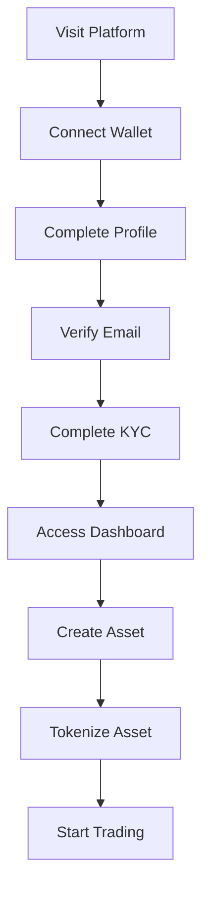
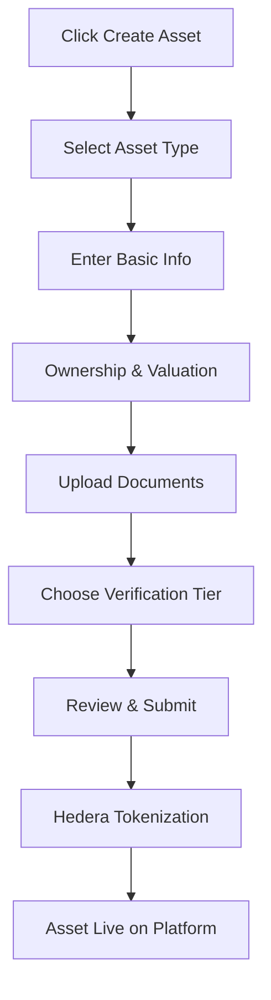
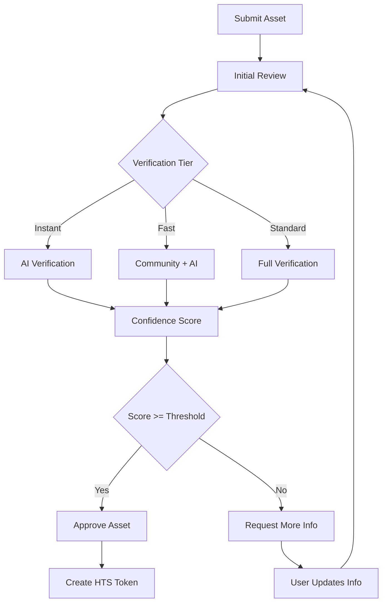
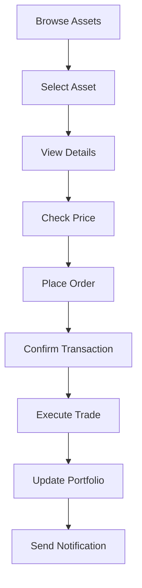

# 🌍 TrustBridge Universal Asset Protocol for Africa

## 📋 Table of Contents
1. [Overview](#overview)
2. [Business Model](#business-model)
3. [Architecture](#architecture)
4. [Core Features](#core-features)
5. [User Flows](#user-flows)
6. [Technical Implementation](#technical-implementation)
7. [Smart Contracts](#smart-contracts)
8. [API Documentation](#api-documentation)
9. [Revenue Streams](#revenue-streams)
10. [Future Roadmap](#future-roadmap)

---

## 🎯 Overview

**TrustBridge** is a revolutionary real-world asset (RWA) tokenization platform specifically designed for the African market. Built on Hedera Hashgraph, it enables farmers, property owners, and small businesses to tokenize their assets and access global capital markets.

### 🌟 Mission
Democratize access to capital for African entrepreneurs by tokenizing real-world assets and creating a bridge between traditional African economies and global DeFi markets.

### 🎯 Vision
Become the leading RWA tokenization platform in Africa, enabling $1B+ in asset tokenization by 2025.

### 🏆 Unique Value Propositions
- **Ultra-low costs**: $0.001 per transaction (vs $50+ on Ethereum)
- **Mobile-first design**: Optimized for African smartphone users
- **Rural accessibility**: Works offline and with poor connectivity
- **Local verification**: Community-based attestation system
- **Native token economics**: TRUST token with staking rewards

---

## 💰 Business Model

### 🏗️ Core Business Model
**Asset Tokenization as a Service (ATaaS)** - We tokenize real-world assets and earn fees on every transaction.

### 📊 Revenue Streams

#### 1. **Tokenization Fees** (Primary Revenue)
- **Rate**: 2% of asset value
- **Example**: $50,000 property = $1,000 fee
- **Target**: 100 assets/month = $500,000/month

#### 2. **Verification Fees** (Secondary Revenue)
- **Rate**: 1% of asset value
- **Example**: $50,000 property = $500 fee
- **Target**: 100 verifications/month = $250,000/month

#### 3. **Platform Fees** (Recurring Revenue)
- **Rate**: 0.5% per transaction
- **Example**: $10,000 trade = $50 fee
- **Target**: 1,000 trades/month = $50,000/month

#### 4. **Attestor Fees** (Quality Revenue)
- **Rate**: 1% of asset value
- **Example**: $50,000 property = $500 fee
- **Target**: 50 attestations/month = $125,000/month

#### 5. **Staking Rewards** (Token Economics)
- **Rate**: 5-25% APY on TRUST token staking
- **Source**: Fee distribution to stakers
- **Target**: $1M+ staked = $50,000-250,000/year

### 💵 Total Revenue Projection
```
Year 1: $1.2M (100 assets/month)
Year 2: $6M (500 assets/month)
Year 3: $18M (1,500 assets/month)
Year 4: $36M (3,000 assets/month)
Year 5: $60M (5,000 assets/month)
```

---

## 🏗️ Architecture

### 🎨 Frontend Architecture
```
React + Vite + TypeScript
├── Components/
│   ├── UI/ (Reusable components)
│   ├── Auth/ (Authentication flows)
│   ├── Dashboard/ (User dashboard)
│   ├── Asset/ (Asset management)
│   └── Verification/ (KYC/Verification)
├── Contexts/
│   ├── AuthContext (User authentication)
│   ├── WalletContext (Wallet connection)
│   ├── ThemeContext (Light/Dark mode)
│   └── SidebarContext (Navigation)
├── Services/
│   ├── api.ts (Backend API calls)
│   ├── ipfs.ts (IPFS file uploads)
│   └── hedera.ts (Hedera integration)
└── Pages/
    ├── Auth/ (Login, KYC, Profile)
    ├── Dashboard/ (Main dashboard)
    ├── Assets/ (Asset management)
    └── Portfolio/ (Investment tracking)
```

### ⚙️ Backend Architecture
```
NestJS + MongoDB + Hedera
├── Modules/
│   ├── Auth/ (Authentication & KYC)
│   ├── Assets/ (Asset management)
│   ├── Hedera/ (Blockchain integration)
│   ├── IPFS/ (File storage)
│   ├── Payments/ (Fee processing)
│   ├── Verification/ (Asset verification)
│   ├── Attestors/ (Verification providers)
│   ├── Portfolio/ (User portfolios)
│   ├── Analytics/ (Data analytics)
│   └── Admin/ (System administration)
├── Services/
│   ├── HederaService (Token creation)
│   ├── IPFSService (File uploads)
│   ├── VerificationService (Asset verification)
│   └── PaymentService (Fee processing)
└── Schemas/
    ├── User (User profiles)
    ├── Asset (Asset data)
    ├── Verification (Verification status)
    └── Payment (Transaction records)
```

### 🔗 Blockchain Integration
```
Hedera Hashgraph
├── HTS (Hedera Token Service)
│   ├── Asset tokens (Individual assets)
│   ├── TRUST token (Native platform token)
│   └── Pool tokens (Future feature)
├── Smart Contracts
│   ├── TrustToken.sol (Native token)
│   ├── AssetFactory.sol (Asset creation)
│   ├── AttestorManager.sol (Verification)
│   └── FeeDistribution.sol (Fee allocation)
└── Oracles
    └── Chainlink (Price feeds)
```

---

## 🚀 Core Features

### 1. 🔐 **Authentication & KYC System**

#### **Wallet Connection**
- **Supported Wallets**: MetaMask, HashPack, WalletConnect
- **Connection Flow**: Connect → Sign Message → Verify Address
- **Security**: JWT tokens with refresh mechanism

#### **Profile Completion**
- **Required Fields**: Name, Email, Phone, Country
- **Validation**: Email verification with 6-digit code
- **Storage**: Encrypted in MongoDB

#### **KYC Verification**
- **Provider**: Didit (v2 API)
- **Process**: Document upload → Verification → Status update
- **Statuses**: `pending`, `approved`, `rejected`
- **Webhook**: Real-time status updates

### 2. 🏠 **Asset Tokenization**

#### **Asset Types Supported**
- **Real Estate**: Residential, Commercial, Agricultural
- **Agricultural**: Farmland, Crops, Livestock
- **Equipment**: Machinery, Vehicles, Tools
- **Commodities**: Gold, Diamonds, Oil

#### **Tokenization Process**
1. **Asset Information**: Type, location, value, ownership
2. **Document Upload**: Legal documents, photos, certificates
3. **Verification**: Multi-tier verification system
4. **Token Creation**: HTS token on Hedera
5. **Trading**: Secondary market trading

#### **Verification Tiers**
- **Instant**: < 1 hour, 95%+ confidence, $1,000+ assets
- **Fast**: 1-24 hours, 85%+ confidence, $10,000+ assets
- **Standard**: 1-7 days, 70%+ confidence, all assets

### 3. 💰 **Native Token (TRUST)**

#### **Token Economics**
- **Name**: TrustBridge
- **Symbol**: TRUST
- **Max Supply**: 1,000,000,000 TRUST
- **Initial Supply**: 200,000,000 TRUST
- **Decimals**: 18

#### **Staking System**
- **Lock Periods**: 30-365 days
- **APY Range**: 5-25%
- **Minimum Stake**: 1,000 TRUST
- **Rewards**: Distributed from platform fees

#### **Fee Distribution**
- **Treasury**: 40% (Platform development)
- **Stakers**: 30% (TRUST token holders)
- **Insurance**: 20% (Risk mitigation)
- **Validators**: 10% (Network security)

### 4. 📱 **Mobile-First Design**

#### **African Market Optimization**
- **Offline Mode**: Works without internet connection
- **USSD Integration**: *123# for basic functions
- **SMS Notifications**: Important updates via SMS
- **Local Languages**: English, French, Swahili, Yoruba
- **Low Data Mode**: Optimized for slow connections
- **Voice Interface**: Voice commands in local languages

#### **Rural Farmer Features**
- **Community Verification**: Local leaders verify farmers
- **Micro-Investments**: Start with $10
- **Crop Insurance**: Weather-based insurance products
- **Equipment Sharing**: Tokenized equipment rental

### 5. 🔍 **Verification System**

#### **Multi-Tier Verification**
- **Document Verification**: Legal documents, certificates
- **Photo Verification**: Asset photos, satellite imagery
- **Community Verification**: Local attestation
- **Professional Verification**: Licensed attestors

#### **Confidence Scoring**
- **Document Completeness**: 25%
- **Asset Value**: 25%
- **Documentation Quality**: 25%
- **Location Verification**: 15%
- **Ownership Verification**: 10%

### 6. 📊 **Portfolio Management**

#### **User Dashboard**
- **Asset Overview**: Total value, performance, returns
- **Recent Activity**: Transactions, verifications, updates
- **Quick Actions**: Create asset, view portfolio, manage assets
- **Analytics**: Performance charts, risk metrics

#### **Investment Tracking**
- **Real-time Updates**: WebSocket notifications
- **Performance Metrics**: ROI, APY, risk scores
- **Historical Data**: Price history, transaction logs
- **Export Features**: PDF reports, CSV data

---

## 🔄 User Flows

### 1. **New User Onboarding**



### 2. **Asset Creation Flow**



### 3. **Verification Process**



### 4. **Trading Flow**



---

## 🛠️ Technical Implementation

### **Frontend Stack**
```json
{
  "framework": "React 18",
  "buildTool": "Vite",
  "language": "TypeScript",
  "styling": "Tailwind CSS",
  "stateManagement": "React Context",
  "routing": "React Router",
  "animations": "Framer Motion",
  "uiComponents": "Custom + Radix UI",
  "httpClient": "Axios",
  "blockchain": "Hedera SDK"
}
```

### **Backend Stack**
```json
{
  "framework": "NestJS",
  "language": "TypeScript",
  "database": "MongoDB",
  "orm": "Mongoose",
  "authentication": "JWT",
  "fileStorage": "IPFS (Pinata)",
  "blockchain": "Hedera SDK",
  "oracles": "Chainlink",
  "payments": "Stripe",
  "kyc": "Didit API",
  "documentation": "Swagger"
}
```

### **Blockchain Stack**
```json
{
  "network": "Hedera Hashgraph",
  "consensus": "aBFT (asynchronous Byzantine Fault Tolerance)",
  "tokens": "HTS (Hedera Token Service)",
  "smartContracts": "Solidity",
  "oracles": "Chainlink",
  "storage": "IPFS",
  "wallets": "MetaMask, HashPack"
}
```

---

## 📜 Smart Contracts

### **1. TrustToken.sol** - Native Platform Token
```solidity
contract TrustToken is ERC20, AccessControl, Pausable, ReentrancyGuard {
    // Token details
    string public constant name = "TrustBridge";
    string public constant symbol = "TRUST";
    uint256 public constant MAX_SUPPLY = 1_000_000_000 * 1e18;
    uint256 public constant INITIAL_SUPPLY = 200_000_000 * 1e18;
    
    // Staking functionality
    mapping(address => uint256) public stakingBalances;
    mapping(address => uint256) public stakingTimestamps;
    mapping(address => uint256) public lockPeriods;
    
    // Functions
    function stake(uint256 amount, uint256 lockPeriod) external;
    function unstake() external;
    function calculateReward(address staker) public view returns (uint256);
}
```

### **2. AssetFactory.sol** - Asset Tokenization
```solidity
contract AssetFactory is AccessControl, Pausable, ReentrancyGuard {
    struct Asset {
        bytes32 id;
        address owner;
        string assetType;
        string name;
        string location;
        uint256 totalValue;
        uint256 tokenSupply;
        uint256 maturityDate;
        uint8 verificationScore;
        bool isActive;
        address tokenContract;
    }
    
    // Functions
    function tokenizeAsset(...) external payable returns (bytes32);
    function verifyAsset(...) external;
    function getUserAssets(address user) external view returns (bytes32[]);
}
```

### **3. AttestorManager.sol** - Verification System
```solidity
contract AttestorManager is AccessControl, ReentrancyGuard {
    struct AttestorInfo {
        bool isActive;
        uint256 stakeAmount;
        uint256 reputationScore;
        string organizationType;
        string country;
        uint256 totalAttestations;
        uint256 correctAttestations;
    }
    
    // Functions
    function registerAttestor(...) external payable;
    function updateAttestorReputation(address attestor, bool wasCorrect) external;
    function slashAttestor(address attestor, string memory reason) external;
}
```

### **4. FeeDistribution.sol** - Fee Allocation
```solidity
contract FeeDistribution is AccessControl, ReentrancyGuard {
    struct FeeAllocation {
        uint256 treasury;      // 40%
        uint256 stakers;       // 30%
        uint256 insurance;     // 20%
        uint256 validators;    // 10%
    }
    
    // Functions
    function distributeFees() external payable;
    function claimValidatorRewards() external;
}
```

---

## 📡 API Documentation

### **Authentication Endpoints**
```typescript
// POST /api/auth/check-wallet
interface CheckWalletRequest {
  walletAddress: string;
}

interface CheckWalletResponse {
  exists: boolean;
  user?: User;
  needsProfile?: boolean;
  needsKYC?: boolean;
}

// POST /api/auth/generate-token
interface GenerateTokenRequest {
  walletAddress: string;
}

interface GenerateTokenResponse {
  accessToken: string;
  refreshToken: string;
  expiresIn: number;
}
```

### **Asset Endpoints**
```typescript
// POST /api/assets/create-with-tokenization
interface CreateAssetRequest {
  owner: string;
  type: string;
  name: string;
  description: string;
  location: {
    country: string;
    region: string;
    coordinates: { lat: number; lng: number };
  };
  totalValue: number;
  tokenSupply: number;
  maturityDate: string;
  expectedAPY: number;
  metadata: AssetMetadata;
}

interface CreateAssetResponse {
  success: boolean;
  assetId: string;
  tokenId: string;
  transactionId: string;
  verificationTier: string;
  processingTime: number;
}
```

### **IPFS Endpoints**
```typescript
// POST /api/ipfs/upload
interface UploadFileRequest {
  file: File;
  fileName: string;
  fileType: string;
  metadata: object;
}

interface UploadFileResponse {
  success: boolean;
  data: {
    cid: string;
    ipfsUrl: string;
    size: number;
    type: string;
  };
}
```

### **Verification Endpoints**
```typescript
// POST /api/verification/smart-verification
interface SmartVerificationRequest {
  assetId: string;
  tier: 'instant' | 'fast' | 'standard';
  confidenceScore: number;
}

interface SmartVerificationResponse {
  success: boolean;
  verificationId: string;
  estimatedTime: number;
  requirements: string[];
}
```

---

## 💰 Revenue Streams

### **1. Tokenization Fees (Primary)**
- **Rate**: 2% of asset value
- **Example**: $100,000 property = $2,000 fee
- **Monthly Target**: 100 assets = $500,000
- **Annual Target**: 1,200 assets = $6,000,000

### **2. Verification Fees (Secondary)**
- **Rate**: 1% of asset value
- **Example**: $100,000 property = $1,000 fee
- **Monthly Target**: 100 verifications = $250,000
- **Annual Target**: 1,200 verifications = $3,000,000

### **3. Platform Fees (Recurring)**
- **Rate**: 0.5% per transaction
- **Example**: $10,000 trade = $50 fee
- **Monthly Target**: 1,000 trades = $50,000
- **Annual Target**: 12,000 trades = $600,000

### **4. Attestor Fees (Quality)**
- **Rate**: 1% of asset value
- **Example**: $100,000 property = $1,000 fee
- **Monthly Target**: 50 attestations = $125,000
- **Annual Target**: 600 attestations = $1,500,000

### **5. Staking Rewards (Token Economics)**
- **Source**: Fee distribution to stakers
- **Rate**: 5-25% APY on TRUST tokens
- **Target**: $1M+ staked = $50,000-250,000/year

### **6. Premium Features (Future)**
- **Advanced Analytics**: $99/month
- **API Access**: $299/month
- **White-label Solutions**: $10,000 setup + $1,000/month
- **Institutional Onboarding**: $25,000 setup + $2,500/month

---

## 🚀 Future Roadmap

### **Phase 1: Foundation (Q1 2024)**
- ✅ Core platform development
- ✅ Hedera integration
- ✅ Basic tokenization
- ✅ KYC integration
- ✅ Mobile optimization

### **Phase 2: Scale (Q2 2024)**
- 🔄 Pool management system
- 🔄 Secondary market trading
- 🔄 Advanced verification
- 🔄 Professional attestors
- 🔄 API marketplace

### **Phase 3: Institutional (Q3 2024)**
- ⏳ SPV structure
- ⏳ Compliance tools
- ⏳ Enterprise onboarding
- ⏳ Advanced analytics
- ⏳ Risk management

### **Phase 4: Global (Q4 2024)**
- ⏳ Multi-chain support
- ⏳ Cross-border payments
- ⏳ International partnerships
- ⏳ Regulatory compliance
- ⏳ Global expansion

### **Phase 5: Innovation (2025)**
- ⏳ AI-powered verification
- ⏳ IoT integration
- ⏳ DeFi integrations
- ⏳ Advanced derivatives
- ⏳ Carbon credits

---

## 📊 Success Metrics

### **User Metrics**
- **Monthly Active Users**: 10,000+ by Q4 2024
- **Asset Tokenization**: 1,000+ assets by Q4 2024
- **Total Value Locked**: $100M+ by Q4 2024
- **Geographic Coverage**: 20+ African countries

### **Business Metrics**
- **Monthly Revenue**: $1M+ by Q4 2024
- **Customer Acquisition Cost**: <$50
- **Lifetime Value**: >$500
- **Churn Rate**: <5% monthly

### **Technical Metrics**
- **Uptime**: 99.9%
- **Transaction Speed**: <3 seconds
- **Transaction Cost**: <$0.01
- **API Response Time**: <200ms

---

## 🤝 Partnerships & Integrations

### **Blockchain Partners**
- **Hedera Hashgraph**: Primary blockchain
- **Chainlink**: Oracle services
- **IPFS**: Decentralized storage
- **Pinata**: IPFS pinning service

### **Financial Partners**
- **Stripe**: Payment processing
- **Didit**: KYC verification
- **Local Banks**: Fiat on/off ramps
- **Mobile Money**: M-Pesa, MTN Mobile Money

### **Technology Partners**
- **Google Cloud**: Infrastructure
- **MongoDB**: Database services
- **Vercel**: Frontend hosting
- **GitHub**: Code repository

### **Strategic Partners**
- **African Development Bank**: Policy support
- **Local Governments**: Regulatory compliance
- **NGOs**: Rural outreach
- **Universities**: Research collaboration

---

## 📞 Contact & Support

### **Development Team**
- **Lead Developer**: [Your Name]
- **Email**: dev@trustbridge.africa
- **GitHub**: https://github.com/trustbridge
- **Discord**: https://discord.gg/trustbridge

### **Business Inquiries**
- **Email**: business@trustbridge.africa
- **Phone**: +234-XXX-XXXX
- **Address**: Lagos, Nigeria

### **Support**
- **Email**: support@trustbridge.africa
- **Documentation**: https://docs.trustbridge.africa
- **Status Page**: https://status.trustbridge.africa

---

## 📄 License

This project is licensed under the MIT License - see the [LICENSE](LICENSE) file for details.

---

## 🙏 Acknowledgments

- **Hedera Hashgraph** for providing the blockchain infrastructure
- **African Development Bank** for policy guidance
- **Local Communities** for feedback and testing
- **Open Source Community** for the amazing tools and libraries

---

**Last Updated**: December 2024
**Version**: 1.0.0
**Status**: Active Development

---

*TrustBridge - Building the bridge between African assets and global capital markets* 🌍✨
